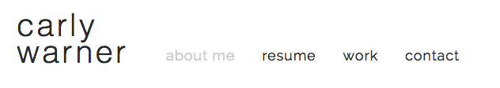

# About Me Page 

### Technologies Used
* HTML
* CSS
* Google Fonts
* Illustrator

### Hover Components
#### Menu Bar Hover

While user is hovering over the different pages on the navigation, the page their cursor is currently hovering will change to a light gray.

#### Social Media Icon Hover

While user is hovering over the different social media icons, the image their cursor is currently hovering will display a light gray circle around it.

### Problems/Future Improvments
* Add a section with images of the websites that I have created throughout the next few weeks
* Continue to update the design with new things I am learning with CSS
* Keep my design cohesive to match my overall style as a designer

### Author(s)
Carly Warner
  

